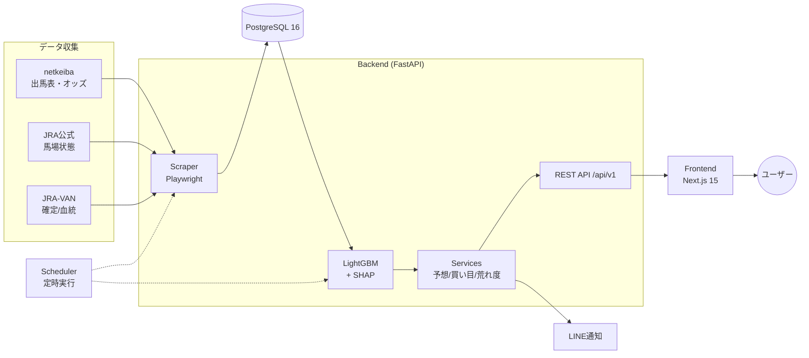
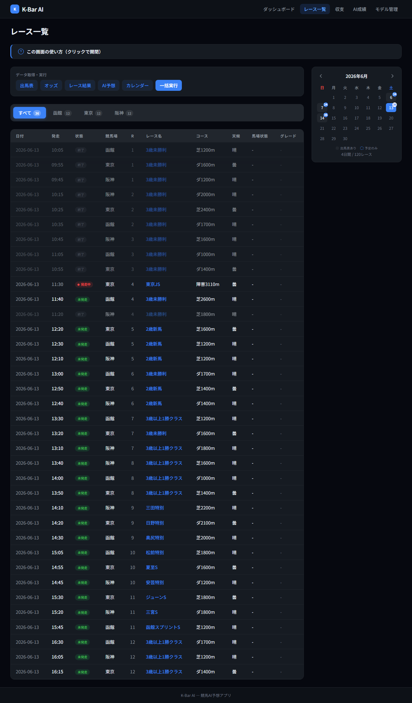
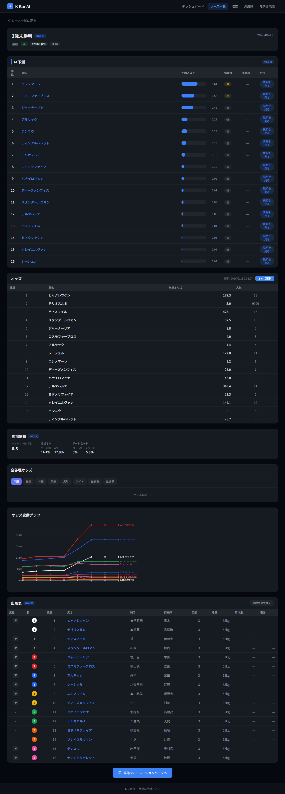
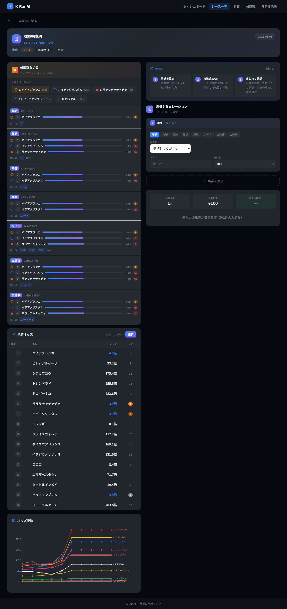

<div align="center">

# 🐎 K-Bar AI — 競馬AI予想アプリ

**機械学習(LightGBM)で中央競馬(JRA)のレースを予想し、根拠(SHAP)・オッズ・馬券戦略までワンストップで提示するWebアプリ&データ基盤。**

[](https://fastapi.tiangolo.com/)
[](https://nextjs.org/)
[](https://lightgbm.readthedocs.io/)
[](https://www.postgresql.org/)
[](https://www.docker.com/)

</div>

> [!IMPORTANT]
> 本アプリは **個人の学習・研究目的** で開発した非商用プロジェクトです。予想の的中・利益を保証するものではありません。馬券の購入は自己責任で、20歳未満の方は購入できません。詳しくは[免責事項](#-免責事項)を参照してください。

---

## 📌 概要

K-Bar AI は、競馬の出馬表・オッズ・過去成績データを自動収集し、機械学習モデルで各馬の能力を評価して **着順予想・推奨買い目・予算別の馬券戦略** を提示するフルスタックアプリです。

単に「予想を出す」だけでなく、

- **なぜその予想なのか**（SHAPによる日本語での根拠説明）
- **どう買うのか**（予算・荒れ度に応じた券種・買い目・配分の自動提案）
- **市場(オッズ)と比べてどうか**（荒れ度スコア・巻き返し穴の検出）

までを一気通貫で扱うことを目指しています。

開発を通じて検証した「**同じ情報源(オッズ)を学習する限り市場(人気)は超えられない**」という知見や、その上で市場を1つ抜くための実験(荒れ度スコア等)も、`docs/` に開発ジャーナルとして残しています。

---

## 🧩 技術的ハイライト

> 個人開発・非商用プロジェクトですが、設計から本番運用までを一人で通した実装です。

- **フルスタックを単独で設計・実装・運用** — FastAPI(非同期 SQLAlchemy) + Next.js 15 / React 19 を一貫して構築。
- **機械学習の内製** — LightGBM の学習〜推論〜**SHAPによる日本語の根拠説明**まで自作。さらに「市場(オッズ)を超えられるか」を 5,000 レース超で厳密にバックテストし、**精度の天井が損失関数ではなく特徴量の情報量にある**ことを定量的に確認（`docs/` に検証記録）。
- **複数データソースの統合** — netkeiba / JRA公式の Playwright スクレイピングと **JRA-VAN(JV-Link)** を、決定的IDマッピングで突合する自前のデータ基盤。
- **本番運用と CI/CD** — Docker Compose + nginx(Basic認証) + VPS。`master` push で **GitHub Actions が自動デプロイ**（pull後の SHA 一致検証でサイレント失敗を検知する堅牢化）。
- **E2Eによる本番監視** — Playwright で本番のデータ/UIをヘルスチェックし、既知バグの再発を自動検知。

---

## ✨ 主な機能

### 🎯 予想・根拠
- **AI着順予想** — LightGBMによる複勝確率ベースの予想（信頼度バッジ付き）
- **SHAP根拠説明** — 「なぜこの馬を推すか」を特徴量寄与とともに日本語で可視化
- **過去5走の馬柱** — 各出走馬の直近成績を折りたたみ表示
- **血統表示** — 父・母父（JRA-VAN / JV-Data 由来）
- **馬場状態** — 含水率・クッション値（JRA公式から開催日スクレイピング）

### 💰 オッズ・馬券戦略
- **全8券種オッズ** — 単勝〜三連単をタブで横断表示（netkeiba主体）
- **買い方比較** — ボックス／フォーメーション／流し（軸1〜2頭・マルチ）の組数・点数を全網羅
- **馬券シミュレーター** — 全組のオッズを自動取得し、買い目別に掛け金を個別配分して収支試算
- **予算指定の買い目自動提案** — 予算を入れると券種・買い目・配分・想定的中率/払戻を自動提示（ガミ防止モードあり）
- **荒れ対応ヘッジ** — 「人気決着」「荒れ」を相互カバーする2本立てフォーメーションを自動生成

### 📊 市場を読むための独自指標
- **荒れ度スコア(upset score)** — レースが荒れる確率を事前評価（AUC 0.65・10分位で単調校正）
- **巻き返し穴(sleeper)検出** — 「条件替わりで人気急落した実力馬」を全成績から炙り出し

### ⚙️ 運用・自動化
- **スケジューラ** — 出馬表/オッズ/結果のスクレイピングと朝の予想実行を定時自動化
- **LINE通知** — 予想・週次/月次レポートの配信
- **本番ヘルスチェック** — Playwrightで本番UI/データの異常を自動検知

---

## 🛠 技術スタック

| 領域 | 技術 |
|------|------|
| **Backend** | Python 3.12 / FastAPI / SQLAlchemy (async) / Alembic / uv |
| **Frontend** | Next.js 15 / React 19 / TypeScript / Tailwind CSS 4 |
| **ML** | LightGBM / SHAP / scikit-learn / pandas |
| **Database** | PostgreSQL 16 |
| **収集** | Playwright（netkeiba/JRA公式スクレイピング）/ JRA-VAN (JV-Link) |
| **Infra** | Docker Compose / nginx (Basic認証) / VPS / GitHub Actions (自動デプロイ) |
| **テスト** | pytest / Playwright (E2E) |

---

## 🏗 アーキテクチャ



**処理の流れ**: スクレイパーが出馬表・オッズを収集 → PostgreSQLに格納 → LightGBMで予想・SHAPで根拠生成 → Servicesが買い目/荒れ度/穴を算出 → REST API経由でNext.jsフロントに表示。収集・予想はスケジューラで定時自動実行。

---

## 📂 ディレクトリ構成

```
k-bar-ai/
├── backend/                 # FastAPI アプリ
│   └── app/
│       ├── api/v1/          # REST エンドポイント (races, predictions, bets, ...)
│       ├── ml/              # LightGBM 学習・推論・SHAP
│       ├── services/        # 予想/買い目提案/荒れ度/sleeper/ヘッジ
│       ├── scraper/         # netkeiba / JRA公式 スクレイパー
│       ├── scheduler/       # 定時ジョブ
│       └── schemas/         # Pydantic スキーマ
├── frontend/                # Next.js 15 + React 19
│   ├── src/components/      # 予想表・オッズ・シミュレーター 等 UI
│   └── e2e/                 # Playwright E2E / 本番ヘルスチェック
├── docker/                  # docker-compose (dev / prod) + nginx
├── deploy/                  # VPS セットアップスクリプト
├── docs/                    # 開発ジャーナル・設計メモ・検証記録
└── Makefile                 # よく使うコマンド集
```

---

## 🚀 セットアップ（ローカル開発）

> 前提: Docker / Node.js 20+ / [uv](https://github.com/astral-sh/uv)

```bash
# 1. 環境変数を用意（値は自分のものに）
cp .env.example .env

# 2. PostgreSQL を起動
docker compose -f docker/docker-compose.yml --env-file .env up -d

# 3. DB マイグレーション
cd backend && uv run alembic upgrade head

# 4. バックエンド API（http://localhost:8000, /docs にSwagger）
uv run uvicorn app.main:app --port 8000

# 5. フロントエンド（http://localhost:3000）
cd ../frontend && npm install && npm run dev
```

`make dev-all` で Docker + API + Frontend を一括起動できます。主要コマンドは `Makefile` を参照してください（`make train` / `make predict` / `make scrape-shutuba` など）。

> [!NOTE]
> APIキー・本番認証情報・SSH鍵などの秘匿値はすべて `.env` / `.env.local`（gitignore対象）で管理しており、リポジトリには含まれません。`*.example` ファイルが必要な変数の雛形です。

---

## 🖼 スクリーンショット

| レース一覧 | レース詳細・予想 | 馬券シミュレーション |
|---|---|---|
|  |  |  |

---

## 📚 開発ジャーナル（`docs/`）

設計判断・バグの原因と対策・モデル検証の結果などを日付付きで蓄積しています。主なもの:

- `docs/20260613-model-improvement-findings.md` — 精度向上が頭打ちになる構造的理由の検証
- `docs/20260621-market-edge-design.md` — 「市場を1つ抜く」ための荒れ度スコア設計
- `docs/20260627-tech-selection-rationale.md` — 技術選定の理由

---

## ⚠️ 免責事項

- 本アプリは開発者個人の **学習・研究目的** で作成された非商用プロジェクトです。
- AI予想は過去データに基づく統計的推定であり、**的中・利益を一切保証しません**。実際、控除率（JRAの約20〜30%）を継続的に上回る戦略は本プロジェクトの検証範囲では見出せていません。
- 馬券の購入は **自己責任** で行ってください。**20歳未満の方は法律により馬券を購入できません**。
- スクレイピングは各サイトの利用規約・アクセス間隔に配慮した実装としています。利用・改変の際は対象サイトの規約を遵守してください。

---

## 📄 ライセンス

本リポジトリは**ポートフォリオ（技術評価・学習参照）目的で公開**しています。ソースコードの**閲覧は自由**ですが、複製・改変・再配布・商用利用は作者の事前許諾が必要です（**全権利留保**）。詳細は [`LICENSE`](LICENSE) を参照してください。

---

<div align="center">
<sub>Personal portfolio project — built for learning, not for profit. 🐎</sub>
</div>
